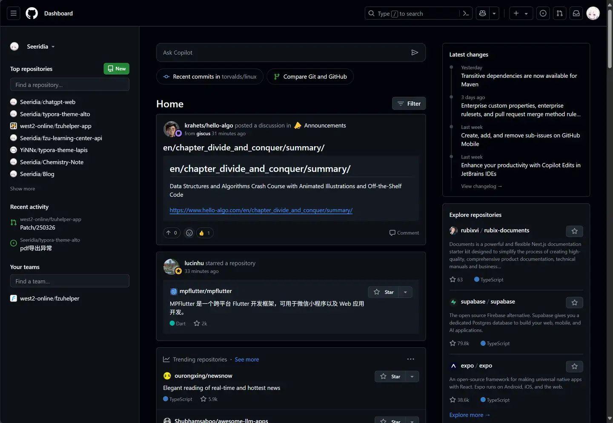
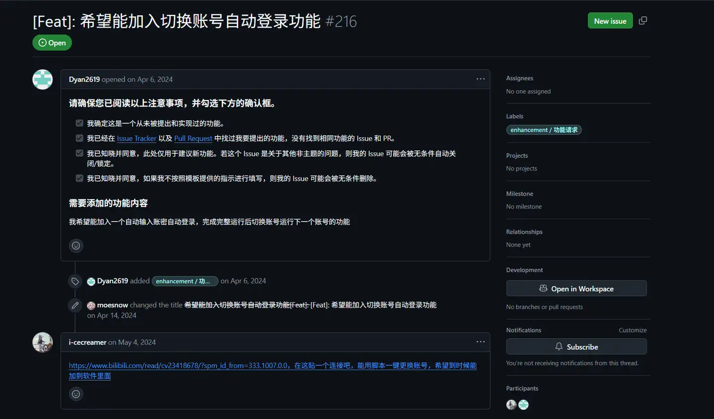
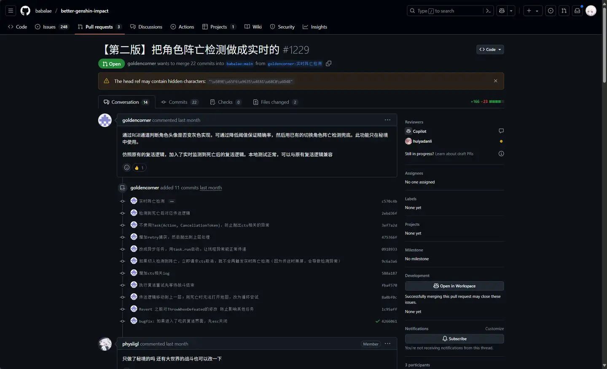

# Github使用方法

## 1. Git基础概念与常用命令

### 1.1 Git是什么？

Git是一个分布式版本控制系统，由Linux之父Linus Torvalds于2005年创建。它的主要作用是追踪和管理代码的变更历史，让开发者能够记录每一次修改、回退到之前的版本，以及与团队成员协同工作。Git通过创建代码的"快照"来保存项目在不同时间点的状态，这使得代码管理变得更加高效和可靠。

### 1.2 本地仓库与远程仓库

Git采用分布式架构，主要涉及两种类型的仓库：

**本地仓库（Local Repository）** 是存储在你个人电脑上的代码库。在本地仓库中，你可以自由地进行代码修改、创建提交（commit）、切换分支等操作，而不需要网络连接。本地仓库包含项目的完整历史记录，这意味着即使离线也能查看历史、创建分支和提交代码。

**远程仓库（Remote Repository）** 是托管在服务器上的代码库，如GitHub、GitLab等平台。远程仓库的作用是作为团队协作的中心枢纽，所有成员都可以将本地的修改推送到远程仓库，也可以从远程仓库拉取最新的代码。这样确保了团队成员之间的代码同步和版本一致性。

### 1.3 什么是Git分支？

分支（Branch）是Git中最强大的功能之一。你可以把分支理解为代码的"平行时间线"——在主分支（通常叫`main`或`master`）上创建一个新分支，就相当于复制了当前代码的一个副本，你可以在这个副本上进行实验性修改，而不会影响主分支的稳定代码。

使用分支的典型场景包括开发新功能、修复bug、或尝试新想法。当分支上的工作完成并测试通过后，可以将其合并（merge）回主分支。这种工作方式让团队能够并行开发多个功能，同时保持主分支的稳定性。

### 1.4 常用Git命令

以下是开始使用Git时需要掌握的核心命令：

#### 初始化仓库
```bash
# 在当前目录创建新的Git仓库
git init

# 或者克隆远程仓库到本地
git clone <远程仓库URL>
```

#### 设定远程仓库
```bash
# 添加远程仓库并命名为origin（惯例名称）
git remote add origin <远程仓库URL>

# 查看已配置的远程仓库
git remote -v
```

#### 提交代码（Commit）
```bash
# 将修改的文件添加到暂存区
git add <文件名>
# 或添加所有修改
git add .

# 提交暂存区的文件到本地仓库
git commit -m "描述本次修改的信息"
```

#### 推送代码（Push）
```bash
# 将本地提交推送到远程仓库
git push origin <分支名>

# 首次推送并设置上游分支
git push -u origin <分支名>
```

#### 拉取代码（Pull）
```bash
# 从远程仓库获取最新代码并合并到当前分支
git pull origin <分支名>

# 等同于 git fetch + git merge
```

#### 合并分支（Merge）
```bash
# 先切换到目标分支（如main）
git checkout main

# 将指定分支合并到当前分支
git merge <要合并的分支名>
```

**工作流程示例：**
```bash
# 1. 初始化并关联远程仓库
git init
git remote add origin https://github.com/username/repo.git

# 2. 修改代码后提交
git add .
git commit -m "添加了新功能"

# 3. 推送到远程仓库
git push -u origin main

# 4. 获取团队成员的最新代码
git pull origin main
```

## 2. GitHub常用操作

### 2.1 认识GitHub界面

当你完成登录后，首先看到的是**个人仪表盘（Dashboard）**，这是你在GitHub上的工作中心。仪表盘主要包含三个区域：

- **中间区域（Home）**：显示你关注的人和项目的最新动态，包括他们的提交、发布和活动
- **左侧栏**：展示你自己的活动记录，包括最近访问的仓库、你的Issue、Pull Request等
- **右侧栏**：GitHub根据你的兴趣推荐的项目和开发者



### 2.2 README文件

README文件是项目的"门面"，通常是访问者了解项目的第一入口。一个好的README文件应该包含以下内容：

**README的作用：**
- 项目简介和功能说明
- 安装和使用方法
- 配置说明和依赖要求
- 贡献指南和开发规范
- 许可证信息

README文件通常使用Markdown格式（.md），放置在项目根目录下。当你访问一个GitHub仓库时，README的内容会自动显示在仓库首页的下方。

**创建README的最佳实践：**
```markdown
# 项目名称
简短的项目描述

## 功能特性
- 功能1
- 功能2

## 安装方法
具体的安装步骤

## 使用示例
代码示例和说明

## 贡献指南
如何参与项目开发

## 许可证
开源协议说明
```

### 2.3 提交Issue（问题反馈）

Issue是GitHub上用于追踪项目问题、功能请求和任务的工具。无论你是发现了bug、有新功能建议，还是需要帮助，都可以通过提交Issue与项目维护者沟通。

#### 什么时候提交Issue？
- 发现软件bug或错误
- 希望添加新功能
- 对文档有疑问或建议
- 需要技术支持和帮助

#### 提交Issue前的准备工作
在提交Issue之前，请务必做好以下检查，这是对开源项目的基本礼仪：

1. **确认使用最新版本**：很多问题可能已在新版本中修复
2. **搜索现有Issue**：避免重复提交相同的问题
3. **准备详细信息**：包括错误信息、复现步骤、系统环境等
4. **保持主题相关**：Issue区域是用于讨论项目问题的，不要发布无关内容

#### 如何提交Issue？

**步骤1：进入Issues页面**
在项目仓库页面，点击顶部的"Issues"标签，然后点击绿色的"New issue"按钮。


**步骤2：填写Issue内容**
一个好的Issue应该包含：

```markdown
**问题描述**
清楚地描述遇到的问题或功能需求

**复现步骤**（如果是bug）
1. 执行了什么操作
2. 看到了什么现象
3. 期望的结果是什么

**环境信息**
- 操作系统：Windows 10 / macOS 13.0 / Ubuntu 22.04
- 软件版本：v1.2.3
- 其他相关信息

**截图或日志**
如果适用，附上截图或错误日志
```

**步骤3：等待回复**
提交后，项目维护者会看到你的Issue并进行回复。你可能需要提供更多信息或参与讨论。



**提示：** Issue不仅是反馈问题的工具，也是学习和参与开源项目的好方法。通过阅读其他人的Issue和维护者的回复，你可以更好地了解项目的设计思路和最佳实践。

### 2.4 Pull Request（代码贡献）

Pull Request（简称PR）是GitHub上贡献代码的核心机制。如果你修复了一个bug、添加了新功能，或者改进了文档，可以通过PR将你的修改请求合并到原项目中。

#### PR的工作流程

**第一步：Fork项目**
在项目页面点击右上角的"Fork"按钮，将项目复制到你自己的GitHub账户下。这样你就有了一个独立的副本可以自由修改。

**第二步：克隆到本地**
```bash
# 克隆你fork的仓库
git clone https://github.com/你的用户名/项目名.git
cd 项目名
```

**第三步：创建新分支**
```bash
# 创建并切换到新分支（分支名应该描述你的修改）
git checkout -b fix-bug-description
```

**第四步：进行修改并提交**
```bash
# 修改代码后提交
git add .
git commit -m "修复：详细描述你的修改"
git push origin fix-bug-description
```

**第五步：创建Pull Request**
1. 访问你fork的仓库页面
2. GitHub会自动提示你有新推送的分支，点击"Compare & pull request"
3. 填写PR标题和详细说明
4. 点击"Create pull request"提交



#### PR规范与最佳实践

提交高质量的PR不仅能提高被合并的概率，也是对项目维护者和其他贡献者的尊重。以下是一些重要的PR规范，理解每条规则背后的原因能帮助你更好地参与开源项目。

##### 1. 控制代码修改量（不超过300-400行）

**为什么这么做？** 代码审查者需要仔细检查每一行修改，当改动超过300行时，人的注意力会急剧下降，容易遗漏bug和潜在问题。同时，大量的修改会让审查者难以理解你的整体意图和逻辑思路，增加沟通成本。从技术角度来说，改动越大，与其他开发者的代码产生冲突的概率就越高，也更容易在合并后引入新的bug。此外，如果PR合并后发现问题需要回滚，小的修改会更容易定位问题并进行修复，而大的修改回滚起来会非常困难。

**如果功能较大怎么办？** 可以将大功能拆分成多个逻辑独立的小PR，按照依赖顺序逐个提交。例如：
```
PR1: 重构现有代码结构，为新功能做准备（150行）
PR2: 实现核心功能逻辑（200行）
PR3: 添加单元测试和集成测试（100行）
PR4: 完善文档和使用示例（80行）
```

每个PR都应该是完整且可以独立审查的，这样不仅降低了审查难度，也让整个开发过程更加清晰可控。

##### 2. 确保提交的是完整功能

**为什么这么做？** 半成品代码最大的问题是无法通过测试，也就无法验证它是否真正解决了问题或实现了功能。当不完整的代码被合并到主分支后，可能会导致项目无法正常运行或编译失败，这不仅影响你自己的工作，也会阻塞其他开发者的进度。从代码审查的角度看，审查者花费时间审查后发现是半成品，就必须要求你继续完善，这实际上浪费了双方的时间。更重要的是，半成品代码进入版本历史会造成混乱，让人无法理解某次提交的真实意图，污染了整个项目的提交记录。

**提交前的自检问题：**
- 这个功能是否完整实现了？能否独立使用？
- 相关的单元测试和集成测试都通过了吗？
- 如果修改了API或功能，文档是否已同步更新？
- 代码中是否处理了所有已知的边界情况和异常？
- 这次提交是否不依赖于未来的其他修改就能正常工作？

**对比示例：**
```
❌ 错误做法
PR标题：开始实现用户登录功能
内容：添加了登录表单UI，但后端验证逻辑还没写完
问题：用户无法真正登录，功能不完整

✅ 正确做法
PR标题：实现用户登录功能
内容：完整的登录功能，包括前端表单、后端验证、
      错误处理、会话管理以及相应的测试用例
```

##### 3. 必须通过测试并添加测试用例

**为什么这么做？** 测试是保证代码质量的第一道也是最重要的防线。没有经过测试的代码就像是未经检验的产品，很可能存在各种隐藏的bug。更重要的是，你的修改可能会无意中影响到项目的其他部分，完善的测试套件能够及时发现这些"回归"问题，避免新修改破坏已有功能。从长远来看，测试用例本身就是最好的代码文档——它清楚地展示了代码应该如何使用，预期的输入输出是什么，比任何文字说明都更直观。当你为自己的修改编写测试并确保通过时，实际上是在向维护者表明：你对自己的代码负责，而不是把验证工作推给别人。

**如何做好测试：**
```bash
# 1. 提交前在本地运行完整的测试套件
npm test        # JavaScript/Node.js项目
pytest          # Python项目
go test ./...   # Go项目

# 2. 检查测试覆盖率，确保新代码被充分测试
npm run test:coverage

# 3. 特别注意：如果你修复了一个bug，一定要添加测试
#    这个测试应该能复现原来的bug，并验证修复后问题消失
```

**测试用例示例：**
```javascript
// 假设你修复了一个用户名验证的bug：
// 之前不允许下划线，现在应该允许

describe('用户名验证功能', () => {
  // 这个测试确保bug被修复
  test('应该接受包含下划线的用户名', () => {
    expect(validateUsername('user_name')).toBe(true);
  });

  // 同时要确保正常的验证逻辑没有被破坏
  test('应该拒绝包含非法字符的用户名', () => {
    expect(validateUsername('user@123')).toBe(false);
    expect(validateUsername('user name')).toBe(false);
  });

  test('应该拒绝过短的用户名', () => {
    expect(validateUsername('ab')).toBe(false);
  });
});
```

##### 4. 不要提交个人配置和临时文件

**为什么这么做？** 个人配置文件（如IDE设置、编辑器配置等）是针对你个人开发环境的，包含的很可能是你本地的路径、个人偏好设置，甚至可能无意中包含敏感信息如API密钥、数据库密码等。这些文件对其他开发者不仅没有用处，反而可能与他们的配置冲突，导致不必要的麻烦。临时文件和编译产物同样不应该进入版本控制，因为它们可以由源代码重新生成，提交它们只会无谓地增加仓库大小。更重要的是，这些无关文件会干扰代码审查者的注意力——他们需要从大量文件变更中分辨哪些是真正重要的代码修改，哪些只是无关的配置，这大大降低了审查效率。

**常见需要排除的文件类型：**
```bash
# IDE和编辑器配置（每个人的设置不同）
.vscode/、.idea/、*.swp、*.sublime-project

# 操作系统生成的文件（对项目无用）
.DS_Store、Thumbs.db、desktop.ini

# 环境变量和密钥文件（包含敏感信息）
.env、.env.local、config.local.js、secrets.yaml

# 依赖包和编译产物（可以重新生成）
node_modules/、dist/、build/、target/、*.pyc、__pycache__/
```

**防止误提交的方法：**
```bash
# 1. 提交前仔细检查修改了哪些文件
git status
git diff

# 2. 如果不小心add了不该提交的文件，立即移除
git reset HEAD <文件名>
git restore --staged <文件名>

# 3. 确保项目根目录有完善的.gitignore文件
# 如果发现某类文件总是被误提交，添加到.gitignore
echo ".env" >> .gitignore
echo ".vscode/" >> .gitignore
echo "node_modules/" >> .gitignore

# 4. 查看.gitignore是否生效
git check-ignore -v <文件名>
```

##### 5. 使用规范的提交信息

**为什么这么做？** 清晰的提交信息是项目历史记录的重要组成部分。当几个月甚至几年后需要查看某段代码为什么这样写时，提交信息往往是唯一的线索。对于团队协作来说，规范的提交信息让其他开发者能够快速理解每次修改的目的和背景，而不需要仔细阅读代码差异。许多现代项目还会使用自动化工具从提交信息生成更新日志（CHANGELOG），这就要求提交信息遵循统一的格式。更深层次地说，专业、规范的提交信息体现了你对代码质量的重视和对团队的尊重，这是开源协作中非常重要的软技能。

**提交信息的标准格式：**
```
<类型>(<影响范围>): <简短描述>

<详细说明>（可选，解释为什么做这个改动）

<关联的Issue或其他说明>（可选）
```

**类型说明：**
- `feat`: 新功能（feature）
- `fix`: 修复bug
- `docs`: 只修改了文档
- `style`: 代码格式调整，不影响代码功能（如空格、缩进）
- `refactor`: 重构代码，既不是新功能也不是bug修复
- `test`: 添加或修改测试
- `chore`: 构建过程或辅助工具的变动（如更新依赖）

**好的提交信息示例：**
```bash
git commit -m "fix(auth): 修复登录时用户名验证失败的问题

之前的正则表达式不支持下划线，导致合法用户名user_name
无法通过验证。现在更新正则表达式并添加了相应测试用例。

Fixes #234"
```

**糟糕的提交信息示例：**
```bash
❌ "更新"           # 完全看不出改了什么
❌ "fix bug"       # 修复了什么bug？
❌ "修改了一些东西"  # 没有任何有用信息
❌ "aaa"           # 随意的信息
```

##### 6. 遵循项目的代码风格

**为什么这么做？** 代码风格的一致性对于项目的长期维护至关重要。想象一下，如果一个项目中有的地方用4个空格缩进，有的地方用2个，有的用Tab，有的用驼峰命名，有的用下划线命名，整个代码库会变得非常混乱，可读性大大降低。统一的代码风格让整个项目看起来像是一个人写的，大大提高了可读性和可维护性。从实际角度说，遵循项目规范可以避免在代码审查时浪费时间讨论格式问题（应该用单引号还是双引号这种无关紧要的争论），让大家把精力集中在真正重要的逻辑和设计上。此外，很多项目使用自动化工具进行代码检查，如果你的代码不符合规范，可能根本无法通过CI检查。

**如何了解和遵循项目规范：**

首先，查看项目根目录是否有这些配置文件：
```bash
.eslintrc.js      # JavaScript/TypeScript代码规范
.prettierrc       # 代码格式化规则
.editorconfig     # 编辑器配置（缩进、换行等）
pyproject.toml    # Python项目配置（black、flake8等）
.rubocop.yml      # Ruby代码规范
```

然后，在修改代码前后运行格式化工具：
```bash
# 检查代码风格问题
npm run lint
eslint .

# 自动修复可以自动修复的问题
npm run lint:fix
prettier --write .

# 运行代码格式化
npm run format
```

**重要提示：**
1. 大多数项目会在 `CONTRIBUTING.md` 或 `README.md` 中说明代码规范要求，务必先阅读
2. 观察现有代码的风格，"入乡随俗"
3. 不要在PR中混入大量的格式化修改，如果需要格式化，最好单独提交一个PR

##### 7. 一个PR只解决一个问题

**为什么这么做？** 这是保持PR清晰和可管理的关键原则。当一个PR同时包含多个不相关的修改时，代码审查者很难保持专注——他们需要在不同的上下文之间不断切换，理解每个修改的目的和影响，这大大增加了认知负担。从技术角度说，如果某个功能有问题需要回滚，你希望只回滚这一个功能而不影响其他修改，但在"大杂烩"式的PR中这几乎不可能做到。而且，不同的修改可能由不同的团队成员负责审查，将它们分开可以让审查并行进行，大大提高效率。最重要的是，单一职责的PR会让项目的提交历史非常清晰，每个PR的目的一目了然，这对于理解项目演进过程非常有价值。

**错误示例 - 一个PR包含太多不相关内容：**
```
PR标题：各种改进和修复
修改内容：
- 修复了登录验证的bug
- 添加了新的用户设置页面
- 更新了README文档
- 优化了数据库查询性能
- 重构了日志系统
- 修改了UI配色方案

问题：
- 审查者不知道从何看起，每个修改都需要不同的专业知识
- 如果登录bug修复有问题，无法单独回滚，会影响其他功能
- 很难写一个准确的PR描述，因为做了太多事情
```

**正确做法 - 拆分成多个聚焦的PR：**
```
PR #1: fix(auth): 修复登录验证bug
      只包含登录相关的修改和测试

PR #2: feat(user): 添加用户设置页面
      只包含新设置页面的实现

PR #3: docs: 更新README安装说明
      只修改文档

PR #4: perf(db): 优化用户查询性能
      只包含数据库优化

PR #5: refactor(log): 重构日志系统
      只重构日志相关代码

PR #6: style(ui): 更新主题配色方案
      只修改样式
```

这样每个PR都非常清晰，可以独立审查、测试和合并。

##### 8. 及时响应审查反馈

**为什么这么做？** 代码审查是一个双向的协作过程。维护者和审查者花费了宝贵的时间仔细检查你的代码、提出建议和问题，及时响应是对他们时间和努力的基本尊重。从实际角度说，拖延响应会导致双方都逐渐忘记当时讨论的上下文和细节，等你几天甚至几周后再回来处理时，审查者可能已经不记得当时为什么提出那个建议了，这会导致需要重新审查，浪费更多时间。更重要的是，你的PR可能阻塞了其他开发者的工作——他们可能在等你的功能合并后才能继续自己的开发。对个人成长而言，代码审查是极其宝贵的学习机会，审查者通常经验更丰富，他们的反馈能帮助你提高编程技能和对项目的理解，积极互动能让你学到更多。

**如何正确响应审查意见：**

审查者提出问题时：
```markdown
审查者："这里的错误处理不够完善，如果网络请求失败会导致程序崩溃"

✅ 好的回应：
"感谢指出这个问题！您说得对，我确实没有考虑网络失败的情况。
我已经添加了try-catch块来处理网络错误，并在第45-52行添加了
相应的测试用例来验证错误处理逻辑。请您再次审查，如果还有
问题请随时告诉我。"

❌ 不好的回应：
"我觉得这样就够了"（防御性态度，缺乏开放心态）
"好的"（没有说明具体做了什么修改）
"这个不重要吧"（不尊重审查者的意见）
（完全不回应，直接提交新的修改）
```

如果你不同意某个建议：
```markdown
✅ 礼貌地解释你的理由：
"感谢建议！关于这个实现方式，我当时考虑是这样的...
这样做的原因是...您觉得是否合理？或者您有更好的方案吗？"

❌ 直接拒绝：
"不行，就得这么写"
"我的方法没问题"
```

**响应的要点：**
- 保持开放和谦虚的态度，虚心接受建议
- 明确说明你做了什么修改，方便审查者验证
- 如果不理解某个建议，大方地提问
- 如果暂时无法修改，解释原因和预计的时间
- 修改完成后，礼貌地请求再次审查

##### 9. PR提交前的完整检查清单

为了确保PR的质量，在点击"Create Pull Request"按钮之前，请对照以下清单逐项检查：

**代码质量检查**
- [ ] 代码已在本地完整测试，功能正常运行
- [ ] 通过了所有自动化测试（`npm test`等）
- [ ] 代码中没有遗留的调试代码（`console.log`、`debugger`、`print()`等）
- [ ] 代码符合项目的编码规范（已运行`lint`检查）
- [ ] 没有出现编译警告或错误

**内容完整性检查**
- [ ] 实现的功能是完整的，不是半成品
- [ ] 单次PR的代码修改量控制在300-400行以内
- [ ] 所有修改都与本次PR的目标相关
- [ ] 没有包含与本PR无关的代码修改

**文件清理检查**
- [ ] 没有提交个人IDE配置文件（`.vscode/`、`.idea/`等）
- [ ] 没有提交环境变量文件（`.env`、`.env.local`等）
- [ ] 没有提交依赖包目录（`node_modules/`等）
- [ ] 没有提交编译产物（`dist/`、`build/`等）
- [ ] 没有提交操作系统临时文件（`.DS_Store`等）

**文档和测试检查**
- [ ] 为新功能或bug修复添加了测试用例
- [ ] 如果修改了API或功能，更新了相关文档
- [ ] 在代码的关键部分添加了必要的注释
- [ ] 如果是公共API，添加了使用示例

**PR描述检查**
- [ ] PR标题清晰描述了本次修改的内容
- [ ] PR描述中说明了修改的原因（为什么改）
- [ ] PR描述中说明了修改的方法（怎么改的）
- [ ] 如果修复bug，说明了bug的复现步骤
- [ ] 关联了相关的Issue（使用`Fixes #123`或`Closes #456`）
- [ ] 如果是UI改动，附上了截图或演示视频

**提交信息检查**
- [ ] 提交信息清晰且符合项目规范
- [ ] 使用了正确的类型标识（`feat`/`fix`/`docs`等）
- [ ] 简短描述准确概括了修改内容
- [ ] 如有需要，添加了详细说明

**完整的PR描述示例：**
```markdown
## 修改说明
修复了在双显示器环境下应用无法正常工作的问题

## 问题描述
当用户使用双显示器时，应用只能在主屏幕或第二屏幕单独运行，
无法跨屏幕移动，也无法在两个屏幕上同时显示内容。

## 问题原因
原来的显示器检测逻辑只考虑了单显示器场景，在检测到多个
显示器时会选择第一个并忽略其他显示器。

## 解决方案
- 重写了显示器检测逻辑，现在可以正确识别所有连接的显示器
- 添加了多显示器支持的配置选项，允许用户选择目标显示器
- 更新了窗口管理代码，支持窗口在不同显示器间移动
- 添加了显示器变化的监听，当用户插拔显示器时自动适配

## 测试方法
1. 连接两个显示器到电脑
2. 启动应用
3. 尝试将应用窗口拖动到第二个显示器
4. 验证应用在两个屏幕上都能正常显示和操作
5. 测试不同分辨率和缩放比例的显示器组合

## 相关测试
- 添加了多显示器环境的单元测试（`test/display.test.js`）
- 添加了窗口移动的集成测试（`test/integration/window.test.js`）
- 所有测试已通过

## 关联Issue
Fixes #456

## 截图
[可以附上修复前后的对比截图]
```

**小贴士：** 你可以把这个检查清单保存为项目的PR模板（`.github/PULL_REQUEST_TEMPLATE.md`），这样每次创建PR时GitHub会自动加载这个模板。

**记住：** 不同的开源项目可能有各自特定的规范和要求，上面的规则是通用的最佳实践。在向任何项目提交PR之前，务必先仔细阅读该项目的 `CONTRIBUTING.md`（贡献指南）文件！这是参与开源项目的第一步，也是最重要的一步。

#### Fork、Clone、PR的关系

简单来说，贡献代码的完整流程是：
1. **Fork**：在GitHub上复制项目到你的账户
2. **Clone**：将你fork的项目下载到本地
3. **Branch**：创建新分支进行修改
4. **Commit & Push**：提交修改并推送到你的GitHub仓库
5. **Pull Request**：请求将你的修改合并到原项目

这种工作流程既保护了原项目的稳定性，又让任何人都能自由地贡献代码，是开源协作的基础。
Pull Request规范与最佳实践
