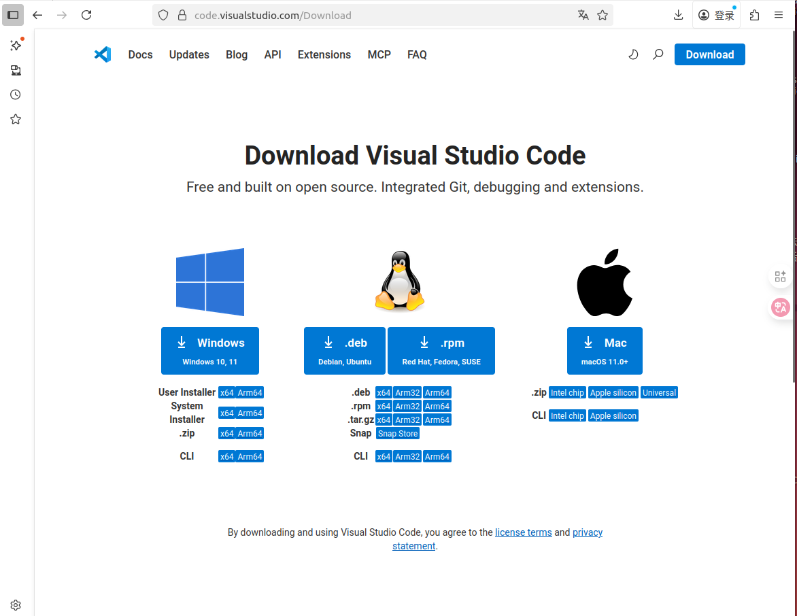
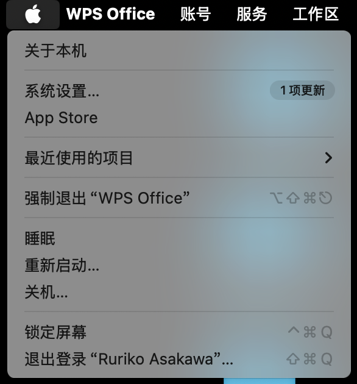
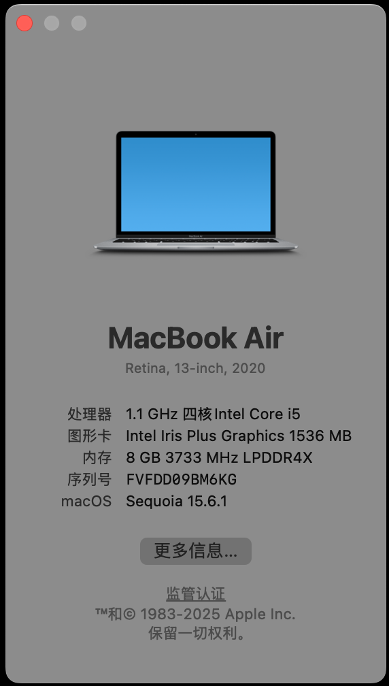
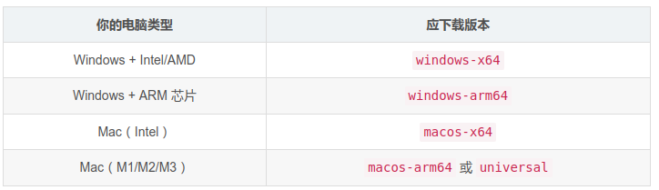

# VsCode使用指南（基础）

---

_写在前面：VsCode作为当今最受开发者欢迎的代码编辑器之一，具备轻量化，扩展良多，完全适配各操作系统，优化良好，内置git支持等种种优点。这个文档主要是为了首次进行VsCode使用的朋友初步适应其使用并进行初步探索，作为非大规模传播非商用文档，文档内容或有源自网络与部分出版物，出处非必需情况下不予一一标明，敬请谅解，也在此由衷感谢下文引用内容来源的开源者。_

---

## 1.什么是VsCode

VSCode（全称：Visual Studio Code）是一款由微软开发且**跨平台**的**免费**源代码编辑器，可选择Windows、Linux、macOS的不同系统对应安装。该软件支持语法高亮、代码自动补全、代码重构、查看定义功能，并且内置了命令行工具和 **Git 版本控制系统**。用户可以更改主题和键盘快捷方式实现个性化设置，也可以通过内置的扩展程序商店安装扩展以拓展软件功能。

VsCode是比较轻量化的代码工具，尽管在较大项目开发上不一定能够满足需求，但适合中小型代码项目的开发与实践，这里推荐使用官网的途径去进行下载，配置与问题解决，以下是相关资源的提供：

_1. **官方网站**：https://code.visualstudio.com/
2. **下载链接**（为了防止读者找不到下载）：https://code.visualstudio.com/Download
3. 基本的**指引文档**（可供自学，笔者当初就是通过这个上手的，不过如果觉得不习惯可以先使用这份文档进行基本的配置）：https://code.visualstudio.com/docs_

## 2.关于下载操作的指引与配套：

我们可以看到在这个下载页面处有着相对复杂的版本信息，这里笔者仅对win和macos进行讲解（默认读者既然能够使用Linux系统应当是不可能不会配置的，只提醒Ubuntu用户应当下载.deb以适应debian内核，使用其他发行版的应该都很熟的，不是这个文档的目标受众）

一般而言，直接点击你的电脑所对应的系统的下载安装，是可以自动检测你的设备情况并且下载相应版本的，倘若出现问题可以手动检查电脑的各项，笔者不太建议使用Windows10以下的版本，因为最新版的VsCode已经不指出使用了，旧版本可能会遇到奇怪的适配问题，如果的确需要可以自行寻找1.70.3的网络下载资源。

手动选择：操作系统不多说，一般来说.zip自己解压或者下载User Installer都行，Windows大多数都是X64的架构，但还是建议手动查看，MacBook则要看看芯片种类，由于笔者恰好三种系统的设备都在使用，这里提供图形化的和终端的查询方案：

Windows：使用终端命令：打开终端输入 _systeminfo_ 查看系统类型或者打开设置如下图(这个是搬的图，大致示意，因为笔者的文档编写在同设备的Ubuntu下，懒得切过去截图了)

MacOS：可以用终端命令 _sysctl machdep.cpu_ ,也可以如下操作：

打开关于本机：

查看处理器型号（请忽略笔者的电脑已经用了两三年了有点老，只是副机就没有换）：

如果感兴趣可以查看这个链接->https://blog.csdn.net/2201_75344078/article/details/149824964
或者直接对照这个表格就好了：

是否为本电脑所有用户安装一般没啥关系都行，协议直接同意下一步就行，安装位置也没有很大关系，就是要留够空间就是了，**不要红盘装把自己的电脑干爆盘就行**。

记得弹窗最好勾选上创建桌面快捷方式（不这样也行，但是这个比较方便）

安装好以后，应该是英文的界面，点开侧边栏这个叫**扩展**的东西（这个其实也是VsCode非常好用的原因之一：大量的扩展）：

下载中文插件（生效在我记忆里是要重启一下VsCode，一般会直接出来重启使生效的弹窗）：

如果还是不行的话按【Ctrl(Mac用command)+shift+p】打开框以后输入configure language，点击Display language，点击中文简体或者zh-cn之类的会有弹窗让你重启VsCode就可以了

#### **怎么用它来运行代码呢？**

对于Python：在上面的扩展里面搜索安装python就行，安装完以后可以试一下，几种系统类同：

而对于c++使用环境的配置，可以在终端看下有没有g++，Linux和MacOS一般是终端输入g++ --version，Windows则是g++ -v，如果没有g++应该是要配一下的

Windows的话要g++一般来说要配置MinGW-w64，链接指路->https://zhuanlan.zhihu.com/p/629298943
也可以自己寻找一些公开教程，Ubuntu一般是自带有g++，不细说，MacOS同理，如果没有可以看这个链接写的还是比较好的，笔者用的就是Xcode->https://bzjuestc.github.io/blog/c/c++%E5%BC%80%E5%8F%91%E7%8E%AF%E5%A2%83/2022/09/01/10-%E5%9C%A8macOS%E4%B8%AD%E4%BD%BF%E7%94%A8gcc%E5%92%8Cg++.html

怎么用c++：当然好像直接.cpp后缀去运行也是能跑的(至少笔者自己使用过来是可以的），但还是说一下，以免有人跑不起来，这个部分我找到比较好的教程链接好像很多浏览器打不开，我把文本po在下面，如果能跑的话有可能下面的步骤也不用做：

1. 准备工作
(1) 安装VS Code  
(2) 安装好C/C++ Extension Pack 扩展
2. 配置文件
创建一个文件夹，这个文件夹就是一个工作空间，我们要在这个工作空间下的 .vscode 文件夹中创建三个配置文件：tasks.json (compiler build settings)、launch.json (debugger settings)、c_cpp_properties.json (compiler path and IntelliSense settings)。也可以参考官网文档
（1）写个源代码文件保持打开状态
（2）创建tasks.json文件，在VS Code的菜单项选择Terminal --> Configure Tasks，
然后在弹出的选项中选择C/C++: g++-13 build active file（如果没有这一项，可以关闭VS Code再重新打开来刷新一下），
随后会自动生成一个tasks.json文件（.vscode文件夹也自动创建），根据自己的情况来修改配置，相关变量的说明可查看官方文档
配置完成后，可以选择 Terminal --> Run Build Task 来编译源文件，生成可执行文件，
（3）创建launch.json文件，用于调试test3.cc，同样保持打开状态，在VS Code菜单项选择 Run --> Add Configuration，
会自动生成launch.json文件， 点击右下角 Add Configuration...，然后选择C/C++:（lldb）Launch，会自动添加配置，根据自己情况修改。（VS Code不同版本，界面操作会有差别）
关闭launch.json文件，回到test3.cc，在VS Code菜单项选择 Run --> Start Debugging，开始调试test3.cc，这里没有设置断点，
没有WARNING也没有ERROR，说明可以调试，关闭调试即可。
（4）创建c_cpp_properties.json文件，使用快捷命令command+shift+p，在命令框中输入C/C++，选择C/C++: Edit Configurations (JSON)，
会自动生成c_cpp_properties.json文件，根据需要来修改，主要修改编译器路径和intelliSenseMode
到此整个配置过程结束，以后就可以使用VS Code调用gcc、gdb来进行C/C++有关的开发了。可以复用整个 .vscode文件夹及配置好的三个文件，直接拷贝到其他项目文件夹下即可。

## 3.关于界面里的一些其他功能：

VsCode是很自由的，有很多的功能可以使用：

页面看不习惯怎么办：

VsCode的内置git也非常强大，你可以在这里查看，这里不做细致说明，可以自行尝试了解，其他资料应该也会提到：

---

_写在最后：编写这份文档时笔者仅为入学一月余的大一新生，因此文中倘有错漏，敬请谅解，如遇问题或希望交流，可以尝试联系笔者的QQ：1739615117 或邮箱：ftlichenghang777@mail.scut.edu.cn，倘对文章内容有异见与斧正也敬请联系交流，郑重感谢您的阅读。_

_编写人：华南理工大学未来技术学院2025级 李承航
编写日期：22 Oct 2025_
